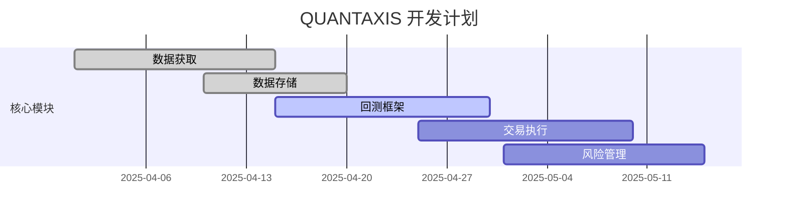

# QUANTAXIS 项目进展

## 已完成功能
- [x] 项目基础结构搭建
- [x] 数据获取框架(QAFetch)
- [x] MongoDB存储适配
- [x] Docker支持
- [x] 基础回测框架

## 进行中工作
- [ ] Python版本升级至3.12+ (首要任务)
- [ ] 数据清洗模块完善
- [ ] 多线程回测引擎
- [ ] 统一交易接口
- [ ] 风险管理模块

## 已知问题
1. 数据获取API偶发超时
2. 回测性能需要优化
3. 文档不完整

## 功能路线图

## 测试覆盖率
- 核心模块: 65%
- 数据模块: 70% 
- 交易模块: 40%
